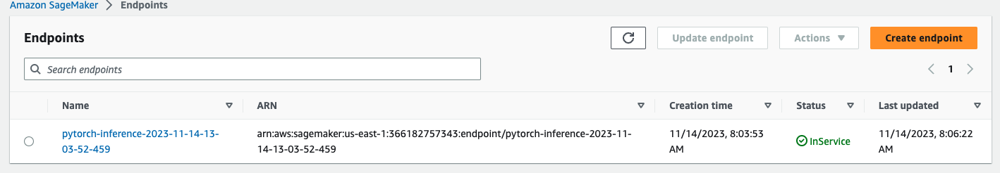
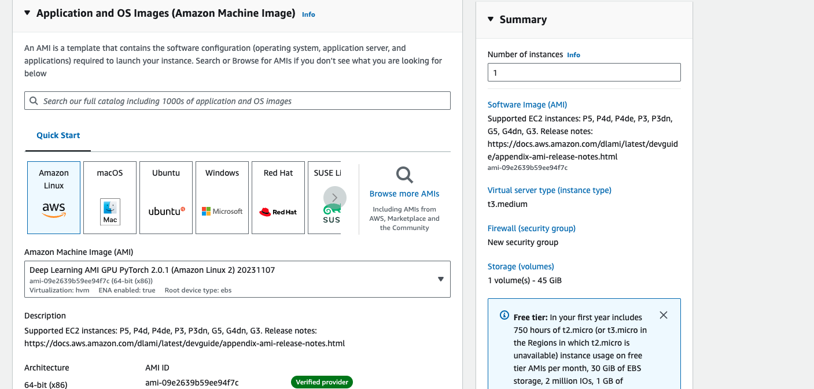
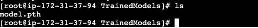

# operationalized-dog-classifier
A dog classifier that will take advantage of multi-instance training and a scaled up inference endpoint.

## Notebook setup
I choose to us an ml.t3.medium notebook type because it will be generally lower cost than using a larger instance. For just code editing using a smaller instance will save money, If I need something more robust for training or inference I will deploy that sepratly.

## Training and Deployment

I created an S3 bucket using the sagemaker session object it is named "operationalized-dog-breed-classifier-project".

Below is a screenshot of the first deployed endpoint (the endpoint that only used single instance training)

Below is a screenshot of the 2nd deployed endpoint (the endpoint that only used multi instance training)

## Cost Effective Training (using EC2)
An alternative to using sagemaker is to use an EC2 instance directly (which is more cost effective). For this part of the project I setup an EC2 instance in the console.

I choose this particular size of instance because I wanted it to be large enough not to take too long for training but not too large to cost too much. I also picked the "Deep Learning AMI GPU PyTorch 2.0.1 (Amazon Linux 2) 20231107" AMI because it would have the pytourch packages I needed already installed on the machine.
Here is a screenshot of the model location after it had been saved.

Training a model this way is more cost effective but lacks certain convineces. For example if I wanted to deploy the model I trained in the EC2 instance I would then need to write a script to manually write the model artifact to an S3 instance (which would require me to setup permissions), then within the console (and sagemaker most likely) choose the model artifact to deploy the instance to an endpoint. This feels like something I would only do for very specialized instances when I had a very small budget.