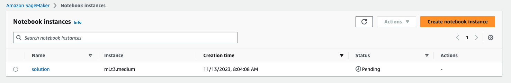
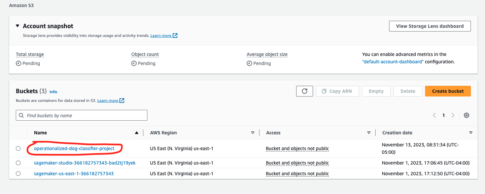
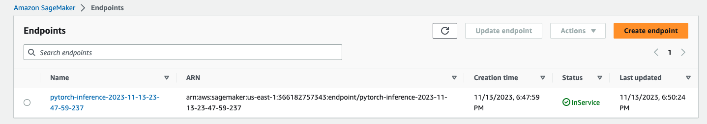

# operationalized-dog-classifier
A dog classifier that will take advantage of multi-instance training and a scaled up inference endpoint.

## Notebook setup
I choose to us an ml.t3.medium notebook type because it will be generally lower cost than using a larger instance. For just code editing using a smaller instance will save money, If I need something more robust for training or inference I will deploy that sepratly.

## Training and Deployment

I created an S3 bucket using the sagemaker session object it is named "operationalized-dog-breed-classifier-project".

Below is a screenshot of the first deployed endpoint (the endpoint that only used single instance training)
