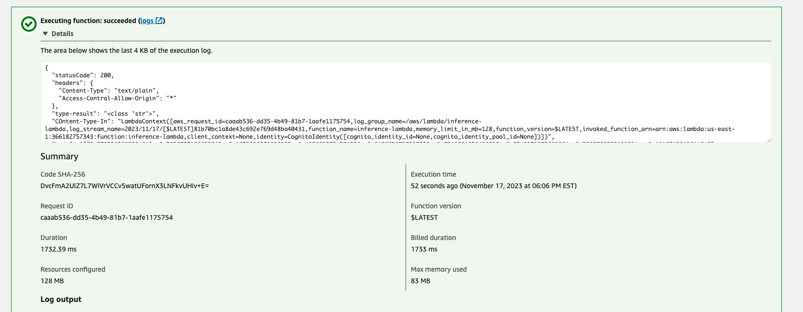

# operationalized-dog-classifier
A dog classifier that will take advantage of multi-instance training and a scaled up inference endpoint.


## Notebook setup
I choose to us an ml.t3.medium notebook type because it will be generally lower cost than using a larger instance. For just code editing using a smaller instance will save money, If I need something more robust for training or inference I will deploy that sepratly.


## Training and Deployment

I created an S3 bucket using the sagemaker session object it is named "operationalized-dog-breed-classifier-project".


Below is a screenshot of the first deployed endpoint (the endpoint that only used single instance training)


Below is a screenshot of the 2nd deployed endpoint (the endpoint that only used multi instance training)


## Cost Effective Training (using EC2)
An alternative to using sagemaker is to use an EC2 instance directly (which is more cost effective). For this part of the project I setup an EC2 instance in the console.

I choose this particular size of instance because I wanted it to be large enough not to take too long for training but not too large to cost too much. I also picked the "Deep Learning AMI GPU PyTorch 2.0.1 (Amazon Linux 2) 20231107" AMI because it would have the pytourch packages I needed already installed on the machine.
Here is a screenshot of the model location after it had been saved.

Training a model this way is more cost effective but lacks certain convineces. For example if I wanted to deploy the model I trained in the EC2 instance I would then need to write a script to manually write the model artifact to an S3 instance (which would require me to setup permissions), then within the console (and sagemaker most likely) choose the model artifact to deploy the instance to an endpoint. This feels like something I would only do for very specialized instances when I had a very small budget.

## Operationalizing Model
### Creating Lambda
The lambda file basically calls the invoke_endpoint using a variable endpoint_Name which is naturally the endpoint I deployed via the notebook and sagemaker.

### Testing Lambda Endpoint
For this part of the exercise I had to navigate to the IAM interface, find my inference lambda role then attach the AmazonSageMakerFullAccess policy. Attaching this policy is fine for this exercise but wouldn't be my first choice for a real world situation. Ideally in more real world situations we would like to limit access of the role, so if I could create a role that simply allowed the lambda to invoke endpoints, that would be a better polcy to attach

the results of my endpoint invocation was:

```
[[0.5792363882064819, 0.7636755108833313, 0.1653096079826355, 0.4950832724571228, 0.8176630735397339, 0.7240684628486633, 0.5346078872680664, 0.3285769522190094, -0.10185138136148453, 0.2920922338962555, 0.6372276544570923, 0.5812382698059082, -0.08509815484285355, 0.37544023990631104, 0.8461633324623108, 0.021534280851483345, 0.10557816922664642, 0.19371265172958374, 0.14003700017929077, 0.3003043234348297, 0.41529303789138794, 0.00643235445022583, 0.1804734468460083, 0.6603132486343384, -0.030782438814640045, -0.09654703736305237, 0.5044122338294983, -0.022909216582775116, 0.6699318885803223, 0.615969181060791, 0.6364791393280029, 0.7549263834953308, -0.024541690945625305, 0.07810435444116592, 0.3004719018936157, 0.5528291463851929, 0.3313681483268738, 0.6378064751625061, 0.5468197464942932, 0.40666159987449646, 0.762763500213623, 0.6268402338027954, 0.35572952032089233, 0.5318848490715027, 0.17492461204528809, 0.7221673727035522, 0.6038680076599121, 0.2621477246284485, 0.40824612975120544, 0.39500364661216736, 0.714881181716919, 0.6262304186820984, 0.40533313155174255, 0.6996309161186218, 0.26447486877441406, 0.5697035789489746, 0.719495415687561, 0.5230414271354675, 0.37702247500419617, 0.45582693815231323, 0.19721060991287231, 0.23548755049705505, 0.13242028653621674, 0.1574971228837967, 0.37834662199020386, -0.09755107760429382, -0.3490096926689148, 0.5763421654701233, 0.25023671984672546, 0.016184493899345398, 0.5006518363952637, 0.36676883697509766, 0.2488367110490799, 0.33383965492248535, 0.0741475522518158, 0.2896389365196228, 0.051754407584667206, 0.03837300091981888, 0.10128553956747055, 0.09817423671483994, 0.5892516374588013, 0.5812305808067322, 0.35266634821891785, -0.10847659409046173, -0.21791903674602509, -0.007983347401022911, 0.5052909255027771, 0.47968733310699463, 0.48889875411987305, 0.6120469570159912, 0.28052493929862976, 0.2681379020214081, -0.11890796571969986, 0.1654740422964096, -0.0032714693807065487, 0.17335288226604462, -0.23192933201789856, 0.0732516348361969, -0.49823227524757385, -0.1330939382314682, 0.26317697763442993, -0.4642694294452667, 0.2237107902765274, 0.22803275287151337, -0.4031201899051666, 0.07531560212373734, 0.4183971881866455, -0.08876407891511917, 0.13764815032482147, -0.25683286786079407, 0.43035510182380676, 0.22272832691669464, 0.08310887962579727, 0.23699021339416504, 0.5412672162055969, -0.4890146553516388, 0.6523604989051819, 0.4549826979637146, -0.5567016005516052, -0.11672106385231018, -0.3893718719482422, 0.07198801636695862, 0.22364474833011627, 0.4074152410030365, -0.22290650010108948, -0.6037143468856812, -0.004977082833647728, -0.24122896790504456, 0.12222044169902802, -0.2430066615343094, 0.12427321076393127, -0.8702178597450256, -0.14377853274345398]]
```

### Concurrency and Auto-Scaling
For Concurency of my lambda function I simply configured it to reserve two instances, as this project will have no request volume I figured the cheapest option was best, obviously if I were recieving a larger number of requests I would need more instances reserved.
For my sagemaker endpoint Autoscalling I just choose to allow it to autoscale between one and two endpoints (again low volume) and have a scale in and scale out values at their defaults as I don't anticipating needing to scale up quickly (scale in) or scale down quickly (scale out).